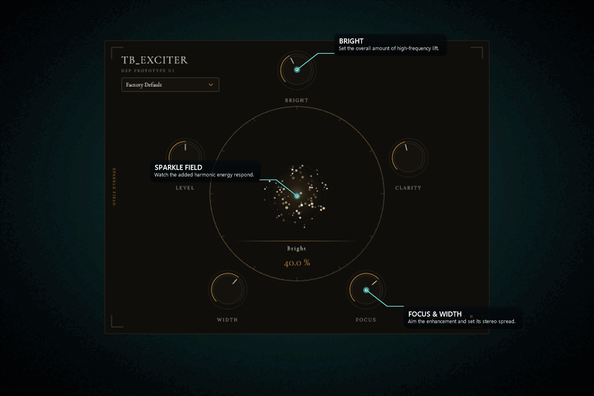
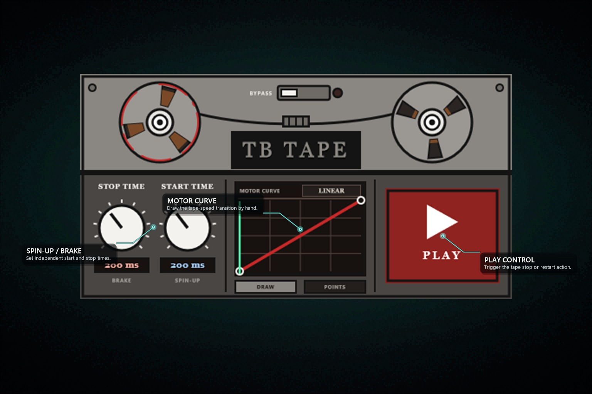

# Update Note

<!-- Keep only the latest three update dates. Add the newest date at the top whenever this repository is updated. -->

## 2026-08-11

- Released TB EQ 2.0.1 for Windows VST3, fixing spectrum-analyzer startup when the host editor first becomes visible.
- Added a regression gate proving the analyzer updates before the SPEED control is clicked, and preserved the existing host contract.
- Normalized the Windows VST3 version and vendor metadata, refreshed the Hub package and catalog, and kept the manual DAW/listening checks marked as deferred.

## 2026-08-10

- Redesigned the complete catalog mockup set and the additional portfolio set around a blurred black gradient, a soft floating glow, and three short English feature guides.
- Re-mapped every guide to a visible analyzer, meter, graph, knob, or control; overlap areas now use compact glass panels and collision-aware leader placement.
- Replaced stale UI sources with current captures, including fresh installed-VST3 snapshots for TB EQ and TB Colorizer.
- Released TB Tape 1.0.0 for Windows VST3 with independent stop/start timing, drawable motor curves, a new DISPLAY logo, and its portfolio mockup.
- Recorded the remaining manual DAW and listening checks as deferred; all automated build, DSP, host-contract, UI, and Standalone smoke gates passed.
- Kept TB Board out of the catalog and release packages, and continued the permanent exclusion of TB Gender Changer.

## 2026-08-09

- Released TB Exciter 1.0.0 with a harmonic enhancement engine, a new DISPLAY icon, and a feature-annotated portfolio mockup.
- Updated TB Exciter to 1.1.0 with a compact 590x450 interface, an accessible selector, and 30 categorized Factory presets.
- Refreshed the TB Exciter DISPLAY logo mirrors and bumped the catalog cache key to force artwork reloading.
- Updated TB Compressor to 2.1.0 with clearer input and gain-reduction feedback.
- Promoted the redesigned TB Tune and TB Vocoder (Beta) to 2.0.0.
- Rebuilt the Windows VST3 packages and synchronized catalog versions, download hashes, sizes, latest-update metadata, and README descriptions.

# Buy me a coffee?
https://ko-fi.com/teamimpulseimpact

# contect me
e-mail : ktb7056@gmail.com

homepage : https://ktb-portfolio.netlify.app/

# TB_Audio-Plugins 🎛️

Welcome to **TB_Audio-Plugins**, a collection of professional-grade, free audio plug-ins designed for music producers, mixing engineers, and sound designers. These plug-ins feature high-quality digital signal processing (DSP) and intuitive user interfaces to elevate your audio production workflow.

*Please note: This repository is used exclusively for distributing the pre-compiled plug-in binaries. Source code is not publicly available.*

## ✨ Key Features
* **Professional Audio Quality:** High-resolution DSP tailored for professional studio environments.
* **Optimized Performance:** Lightweight and highly optimized for low CPU consumption.
* **Cross-Platform Support:** Fully compatible with Windows, macOS, and Linux.
* **Industry-Standard Formats:** Available in VST3 and Audio Unit (AU) formats.
* **100% Free:** Completely free for both personal and commercial audio production.

## 📦 Included Plug-ins

The catalog currently contains 28 plug-ins. Two additional projects have portfolio mockups: TB AudioPlayer and the intentionally unreleased TB Board.

Detailed manuals for the established catalog set are available in English, Korean, Simplified Chinese, Japanese, Spanish, Russian, German, French, Brazilian Portuguese, Italian, Dutch, Swedish, Polish, Turkish, Arabic, Hindi, Indonesian, Thai, Vietnamese, and Czech. Browse the [multilingual manual index](Documents/README.md) to download PDFs by language.

### Catalog plug-ins

#### TB Center

A multiband stereo-centering utility that brings energy toward the middle while preserving useful width and phase coherence.

#### TB Compressor

A Peak/RMS dynamics processor with attack and release shaping, clear gain-reduction metering, and precise level control.

#### TB Distortion

A multi-stage distortion effect for building richer harmonics with tone shaping and a controllable wet/dry blend.

#### TB Disperser

An all-pass phase-dispersion effect that reshapes transients, focuses processing by frequency, and adds animated modulation.

#### TB EQ

A parametric, dynamic, and spectral equalizer for precise cuts, automatic resonance control, and visual frequency shaping.

#### TB Colorizer

A tonal color processor with seven color profiles, a single Transform amount, and preset recall.

#### TB Inverted Flanger

A phase-inverted flanger for hollow subtractive sweeps, with rate, depth, feedback, and mix controls for metallic motion.

#### TB Inverted Phaser

A subtractive phaser that carves animated notches into the signal with adjustable stages and tempo-aware movement.

#### TB Jewel Digger & Finder

A harmonic enhancement and crystal-grain effect for revealing sparkle, adding resonant shimmer, and blending detailed textures.

#### TB Noise Remover

A restoration tool that suppresses steady noise and ambience while preserving voice detail and showing real-time reduction.

#### TB Parallel Reverb

A three-engine parallel reverb that layers independent spaces and builds depth without washing out the dry signal.

#### TB Scrambler

A formant-scramble effect with adjustable Low and High limits, Scramble Amount, and preset recall.

#### TB Spectral Transient Shaper

A frequency-dependent transient processor for shaping attack, controlling sustain, and focusing impact on selected bands.

#### TB Step Shifter (Beta)

A beta harmonic pitch shifter with direct Pitch, Step, and Mix controls plus a Colorize mode.

#### TB Tune

A redesigned vocal pitch-correction tool with direct key and scale selection, pitch-status feedback, Auto Musical response control, and formant shifting.

#### TB Volume

A simple gain tool with decibel and percentage modes plus an exact level readout.

#### TB Vocoder (Beta)

A 32-band vocoder with a resynthesis spectrum, configurable filterbank, and Imprint controls for tonal shaping.

#### TB XYZ Panner

A three-axis spatial panner with pan/depth and height/distance maps plus adjustable room ambience.

#### TB Limiter

A true-peak mastering limiter for increasing loudness, catching inter-sample overloads, and monitoring gain reduction clearly.

#### TB SubLow

A tunable sub-bass generator for adding controlled low-end weight and blending it beneath the original bass content.

#### TB Delay

A creative stereo delay with a visual delay map, rhythm controls, and grain-transform tools for repeat processing.

#### TB Pitch Shifter

An independent pitch and formant processor for transposing audio and changing perceived size with two direct controls.

#### TB Resonator

A tunable modal resonator that turns incoming audio into pitched, playable, and musically aligned textures.

#### TB Ring Modulation

An internal-carrier ring modulator that moves from tremolo pulses to metallic sidebands with controllable tone and mix.

#### TB Recorder

An insert-point recorder with automatic output-format conversion and file splitting for long recording sessions.

#### TB Shimmer

A granular shimmer effect that creates floating grain clouds, octave-up reflections, and spacious feedback tails with tone and width control.

#### TB Exciter

A harmonic exciter and enhancer with 30 Factory presets for controlled brightness, clarity, focus, stereo width, and level.

#### TB Tape

A custom-curve tape-motor effect that slows audio to silence and accelerates it back to speed with independent brake and spin-up timing.

### Additional portfolio plug-ins

These projects have completed mockups but are not catalog releases. TB Board remains intentionally excluded.

#### TB AudioPlayer

A compact one-shot sample player with file browsing, immediate play and stop controls, and visible sample-format information.

#### TB Board

A visual signal-routing workspace and VST3 host for building insert chains and animating parameters with live modulation.

## 🚀 Installation Guide

### 1. Download
Go to the page of this repository and download the latest version compatible with your Operating System.

### 2. Manual Installation
Extract the downloaded zip/archive file and move the plug-in files to your system's designated audio plug-in folders:

#### **Windows:**
* **VST3:** `C:\Program Files\Common Files\VST3`

#### **macOS:**
* **VST3:** `/Library/Audio/Plug-Ins/VST3`
* **AU (Audio Unit):** `/Library/Audio/Plug-Ins/Components`

## 📄 License
The pre-compiled binaries distributed in this repository are licensed under the terms of the **MIT License**. You are free to use these plug-ins in any commercial or non-commercial musical works. For more detailed information, please refer to the [LICENSE](LICENSE) file.

#P.S
---
I am an independent developer who doesn't currently earn any income from my work. In Korea, you can buy a coffee for $1 (really!). Would you be willing to buy me a cup of coffee?

https://ko-fi.com/teamimpulseimpact
---
Fab is offering free audio sources. Please search for "TII" on Fab!

https://www.fab.com/search?q=tii
---
*Built with passion for the audio community. Enjoy creating!* 🎧
